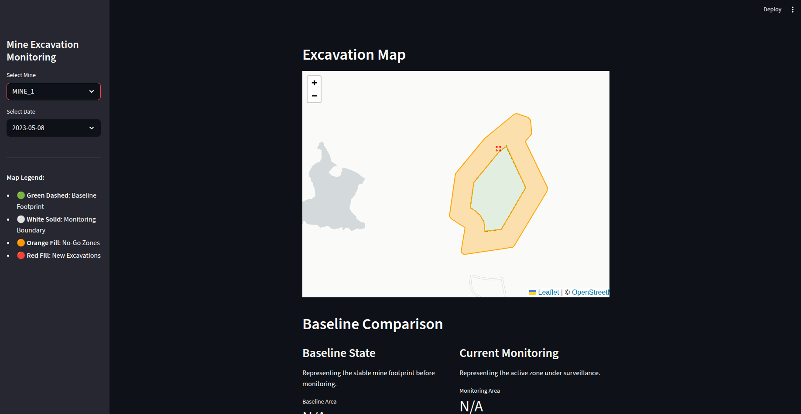

# UI Guide

## 🖥 Dashboard Features

* **Mine Selection:** A sidebar dropdown that dynamically detects and loads data from the `data/mines/` directory.
* **Temporal Navigation:** A date-picker that updates the spatial map to show excavation objects detected on that specific day.
* **Excavation Growth Timeline:** A dynamic line chart showing the cumulative area (ha) of all detected objects within the mine boundary.
* **No-Go Zone Violation Alerts:** A dedicated section that flags any excavation overlapping with protected or restricted zones.
* **Data Export:** A button to download the violation event logs in CSV format for official reporting.

## 🗺 Interactive Map Layers

The map uses a "Traffic Light" logic to help monitors quickly identify risks:

| Layer | Color | Purpose |
| --- | --- | --- |
| **Monitoring AOI** | **White Outline** | Represents the legal or permitted boundary of the mine site. |
| **No-Go Zones** | **Orange Fill** | Represents restricted areas (buffers, forests, water bodies). |
| **Excavation Objects** | **Red Fill** | Represents new land clearing detected on the selected date. |

## 📈 Understanding the Charts

### Excavation Activity

The "Mine-Level Activity" chart tracks the total footprint of the mine. A sharp upward slope indicates rapid expansion, while a flat line indicates a pause in clearing activity.

### Violation Time-Series

If an excavation object overlaps an orange No-Go zone, it is tracked in this chart. It differentiates between:

* **First Violation:** The exact date the first pixel entered the restricted zone.
* **Expansion:** Continuous growth of the footprint inside the restricted zone.
* **Stabilized:** The clearing has stopped growing but remains present.

## 👥 Intended Users

* **Regulators:** To verify if mines are staying within their permitted boundaries.
* **Environmental Monitors:** To track encroachment into protected buffers or water bodies.
* **Mining Compliance Teams:** For internal auditing to prevent expensive legal violations.

